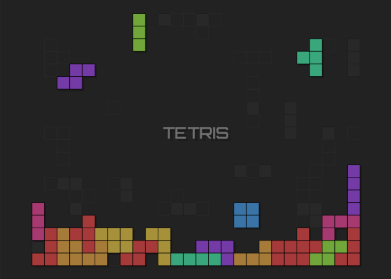
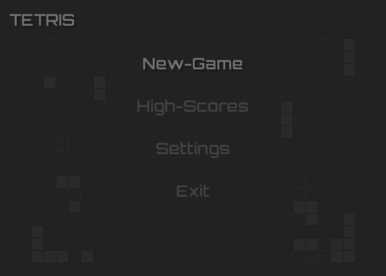
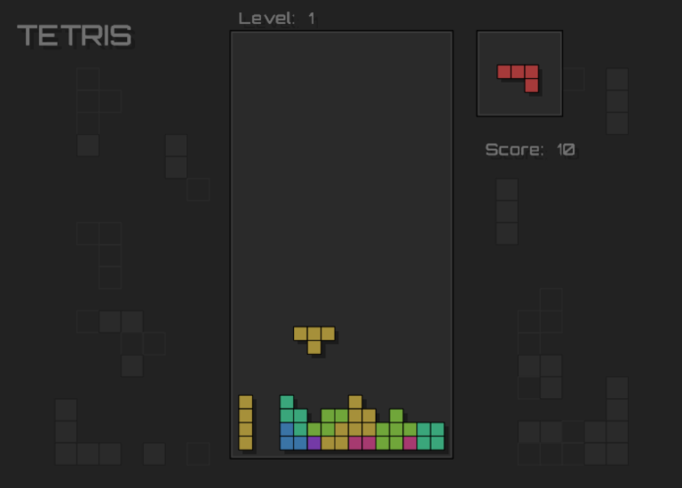

# Tetris

A Tetris clone written with OpenGL and C++.





## Controls

| Key              | Description               |
|:-----------------|:--------------------------|
| Enter            | Accept/Next state         |
| Escape/Backspace | Back/Previous state       |
| Q                | Reset board               |
| R                | Next piece (Score  - 200) |
| Space            | Rotate piece              |
| Left             | Move left                 |
| Right            | Move right                |
| Up               | Move up (Score -1)        |
| Down             | Drop piece                |
| Number pad (-)   | Skip level                |

## Sub-modules

The files [gitupdate.py](gitupdate.py) or [gitupdate.bat](gitupdate.bat) help automate initial cloning and with keeping the modules up to date.

Once this project has been cloned. The following command will initialize external modules.

```txt
python gitupdate.py 
...
gitupdate.bat 
```

_*Sub-modules in this project*_

| Name       | Description                                              |
|------------|----------------------------------------------------------|
| Utils      | Provides common all around functionality.                |
| Math       | Math support.                                            |
| Window     | Window support.                                          |
| Image      | Image I/O.                                               |
| Graphics   | 2D Rendering context.                                    |
| Thread     | Thread support.                                          |
| Json       | Json  support.                                           |
| FreeImage  | Support library for Image.                               |
| FreeType   | Support library for font I/O.                            |
| SDL        | Optional Backend for the window library.                 |
| Data2Array | Compile time tool to pack resources into the executable. |

## Building

Building with CMake and Make

```sh
mkdir build
cd build
cmake ..

make
```

Optional defines.

| Option                     | Description                                                    | Default |
|:---------------------------|:---------------------------------------------------------------|:-------:|
| Tetris_COPY_BIN            | Copy binary to the bin directory.                              |   ON    |
| Tetris_BACKEND_OPENGL      | Build the OpenGL backend.                                      |   ON    |
| Tetris_USE_SDL             | Build with SDL.                                                |   OFF   |
| Tetris_NO_PALETTE          | Disable builtin palette.                                       |   ON    |
| Tetris_OP_CHECKS           | Extra checks on function parameters                            |   ON    |
| Tetris_EXTRA_BUILTIN_FONTS | Include extra [fonts](https://fonts.google.com/) in the build. |   OFF   |


## References

The initial starter tutorial that was used can be found [here](https://javilop.com/gamedev/tetris-tutorial-in-c-platform-independent-focused-in-game-logic-for-beginners/)


